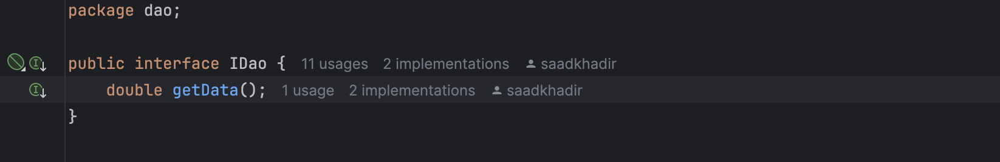
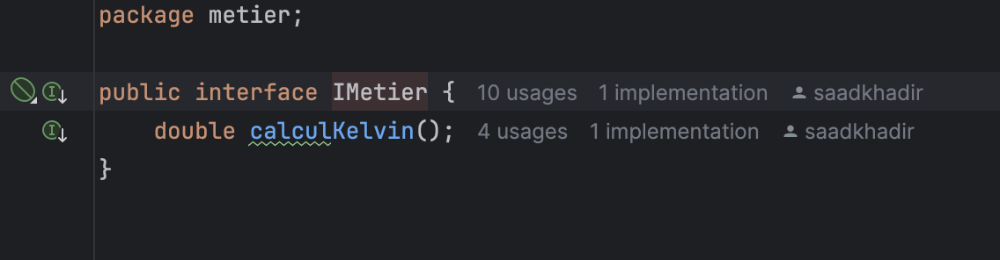
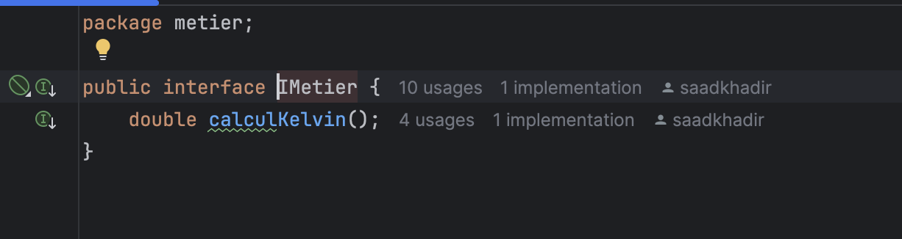
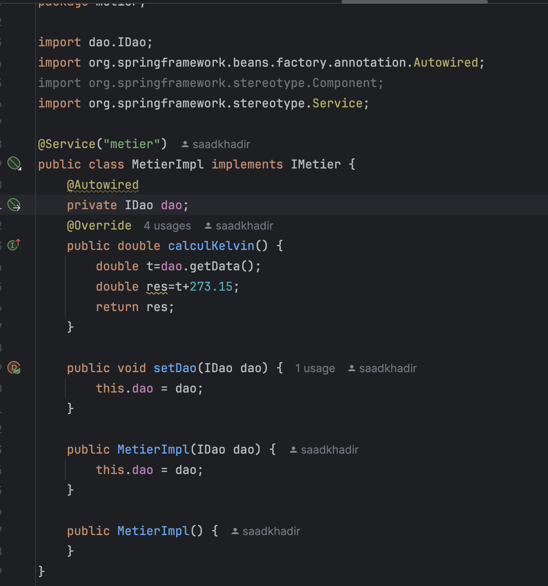
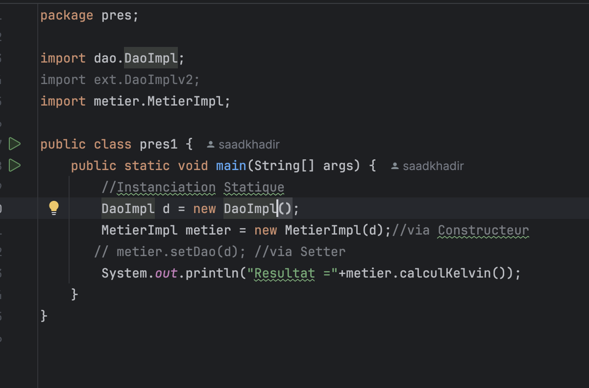
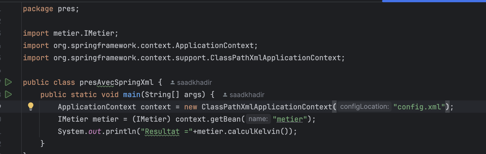
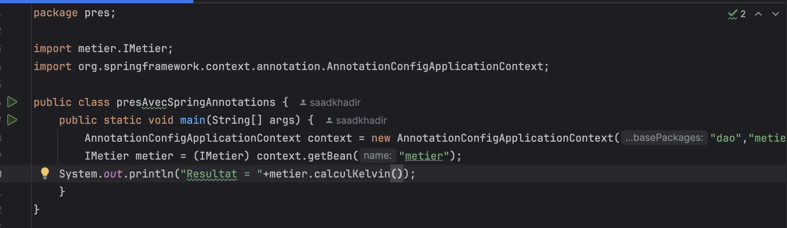

# Spring_tp1
# Spring_tp1

##1. Créer l'interface IDao avec une méthode getData

Cette tâche consiste à définir une interface nommée IDao qui contient une méthode getData. La méthode getData est utilisée pour récupérer des données de la base de données

##2. Implémentation de l'interface

Dans cette étape, on va fournir une implémentations de l'interface IDao.

##3.Interface IMetier avec une méthode calcul

L'objectif de cette tâche est de définir une autre interface, IMetier, qui contient une méthode calcul. Cette méthode pourrait être utilisée pour effectuer un calcul métier du celcuis en Kelvin .

##4. Implémentation de cette interface en utilisant le couplage faible
L'implémentation de l'interface IMetier doit être réalisée en respectant le principe du couplage faible. Cela signifie que la classe qui implémente cette interface ne doit pas dépendre directement de la classe IDao pour obtenir les données.

##5. Injection des dépendances :

###a. Par instanciation statique
L'injection par instanciation statique consiste à créer l'instance de la dépendance au moment de l'instanciation de l'objet.

###b. Par instanciation dynamique
L'injection par instanciation dynamique permet de créer l'instance de la dépendance au moment où l'objet est instancié dans le programme. Cela peut se faire à travers un constructeur ou un setter.

###c. En utilisant le Framework Spring
####- Version XML
Dans la version XML de Spring, on définit les beans dans un fichier de configuration XML. Spring injecte automatiquement les dépendances définies dans le fichier XML lors de l'initialisation du contexte d'application.

####- Version Annotations
En utilisant les annotations de Spring, vous pouvez définir des beans dans votre code Java à l'aide des annotations @Component, @Autowired, etc. Spring se charge de l'injection des dépendances automatiquement

